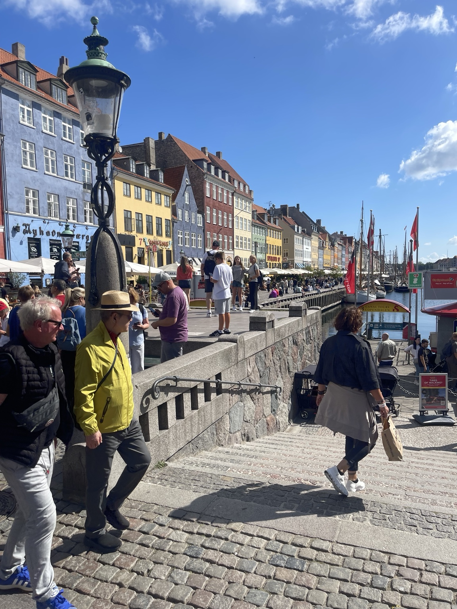
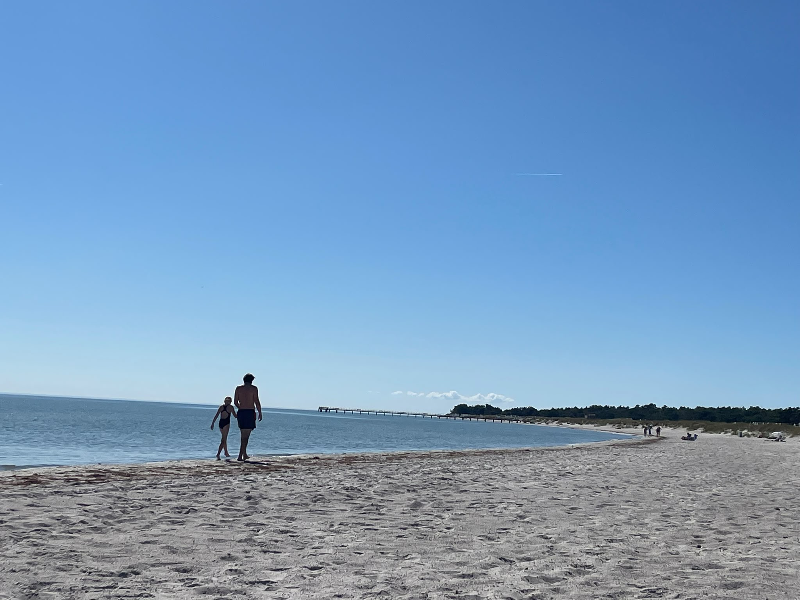

export { MDXLayout as default } from '../components/MDXLayout';
import { SEO } from "../components/SEO"

export const Head = (props) => (
  <SEO
    frontmatter={props?.pageContext?.frontmatter || {}}
    pathname={props?.location?.pathname || ''}
  />
);

We booked the trip about a week before we went. Four nights away together because we fancied getting away and having some time somewhere different: Malmö, Copenhagen and Höllviken. There wasn't much more of a plan than that, which was probably part of the appeal.

One of the things I kept noticing while we were there was how ordinary everything felt, and I mean that as a compliment. Transport worked, paying for things worked, the streets were clean and cycling looked like a completely normal way of getting around rather than something added afterwards. Things generally seemed tidy, maintained and relatively easy to use.

It reminded me of visiting Holland. I remember having much the same reaction there, particularly around cycling and infrastructure. There is something noticeable about places where the different parts appear to fit together and you don't have to think particularly hard about how to use them.

Of course, four days somewhere doesn't tell you what it is like to live there and I'm not about to declare Scandinavia a perfectly functioning society on the basis of a short break. Border control did its best to undermine that argument anyway. We were asked where we were going, how long we were staying and eventually how much money we had, with a demand to prove it. Getting through the border felt almost as long as flying there in the first place.

Still, the contrast with home made me notice things I probably wouldn't normally think about. You buy a ticket, get on a train, cross a road or pay for something and, when none of those things creates unnecessary friction, it barely registers. Maybe that is part of what good systems look like from the outside: mostly unremarkable.

But the trip wasn't really about inspecting infrastructure.

Höllviken was quite a contrast to Copenhagen. We found this glorious beach which was almost empty, despite the weather, and walked along it together. There were loads of jellyfish in the sea — apparently it's the season — which naturally led to us wondering whether they stung.

We asked a local.

“Not dangerous, but water is cold.”

It was.

That little exchange probably says more about why I enjoyed the trip than another paragraph about trains or cycle lanes would. Being somewhere new gives you different things to look at and therefore different things to talk about. At home I can't imagine us suddenly having a conversation about jellyfish, but put us on an almost empty beach in southern Sweden surrounded by them and there you go.

I like that about travelling. Not necessarily the big attractions or the feeling that you need to come home having learned something profound, but the chance to peek briefly into another world. You notice how people move around, what appears normal to them, what works differently and occasionally what is swimming next to you.

Four nights later we came home. I don't have a theory of Scandinavia as a result, although I'd happily borrow some of the cycling infrastructure. It was just good to get away together, encounter somewhere unfamiliar and have conversations we probably wouldn't otherwise have had.

And yes, the water was cold.
