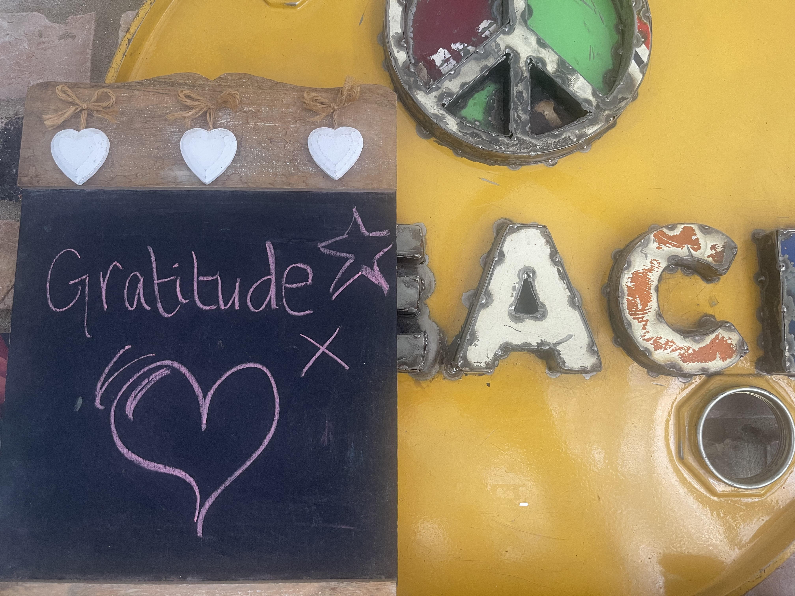

export { MDXLayout as default } from '../components/MDXLayout';
import { SEO } from "../components/SEO"

export const Head = (props) => (
  <SEO
    frontmatter={props?.pageContext?.frontmatter || {}}
    pathname={props?.location?.pathname || ''}
  />
);

Lately I’ve been thinking a lot about building things.

Not in the abstract. Not as a neat metaphor to make life sound more coherent than it really is.

I mean building in the real sense. A life. A home. A family. A career. A way of being in the world that does not fall apart the first time it comes under pressure.

The older I get, the more I realise that anything worthwhile is rarely built in a straight line.

## Building rarely happens in a straight line

That is true of almost everything that matters.

You make progress, then lose confidence. You get something right, then get humbled. You work hard, think you are nearly there, then discover another layer still needs attention. What looks tidy in hindsight rarely feels tidy while you are living it.

Maybe that is one reason gratitude matters more to me now than it once did.

Not as performance. Not as a vague positivity exercise. But as a way of recognising the full shape of the journey, including the parts that did not go to plan.

I can look back now and say, honestly, that I am grateful for the failures as well as the wins.

Not because failure is romantic. It isn’t.

Some of it is painful. Some of it is embarrassing, and some of it leaves marks.

But failure has a way of stripping things back. It exposes what is weak, what is false, and what was only ever being held together by momentum or ego. If you are willing to learn from it, it can also help build something stronger in its place.

## What family teaches you about foundations

That applies to life as much as work.

I became a father at 20. That is young by any standard. I certainly did not have everything (anything) figured out. But even then, I had a sense that this mattered. That being a parent was not a role to drift through. It demanded something of me.

So I worked at it. Imperfectly, of course. Sometimes clumsily. But seriously.

Over the years, I’ve tried to be the best parent I could be. To show up. To keep going. To stay steady. To take responsibility. And when I look at my children now, and the people they have become, I can say without hesitation that it is the greatest gift a man could have.

Not because it happened by accident. It was built.

With love, yes. But also with effort, consistency, sacrifice and repetition. With thousands of ordinary decisions that do not look remarkable in isolation, but over time become the foundations of a family.

I think that is true of most things that last.

People often talk about outcomes, but not enough about foundations. They admire the visible thing and ignore the years of unseen reinforcement underneath it. The structure matters because the footing matters.

## Building properly at work matters too

That thought came back to me this week at work.

It has been a busy one, full of LGR conversations, long days, and the kind of mental load that leaves you tired but strangely energised at the same time. I spent time with colleagues from across Cambridgeshire as part of this week’s IT and Digital workstream, bringing together representatives from all seven councils.

At one point, someone joked that there was more than a thousand years of experience in the room. It made everyone smile, but it also landed.

Beneath all the complexity, all the pressure, and all the uncertainty that comes with something on this scale, what struck me most was not politics or noise. It was the depth of experience in the room, and the shared desire to do the right thing.

That matters.

In a world that often rewards speed, performance, and certainty, it is easy to overlook the quieter virtues. Experience. Judgement. Patience. Care. The willingness to build things properly, rather than theatrically. The discipline to focus on foundations before claiming transformation.

That is true in organisations.

It is true in families.

It is true in a life.

## Gratitude for the long way round

The older I get, the less impressed I am by things that appear quickly and disappear just as fast.

I am more interested in what can be built slowly.

What can hold weight.

What can survive difficulty.

What can be trusted.

Maybe that is what gratitude really is at this stage of life.

It is not just thankfulness for what is pleasant.

It is respect for the whole process.

For the lessons that came through failure.

For the people who stayed.

For the responsibility that shaped you.

For the work that tested you.

For the foundations that did not appear overnight, but were laid one choice at a time.

A life does not build itself.

Neither does a family.

Neither does a career.

Neither does anything that lasts.

And when you realise that, really realise it, gratitude starts to feel less like a mood and more like a form of clarity.