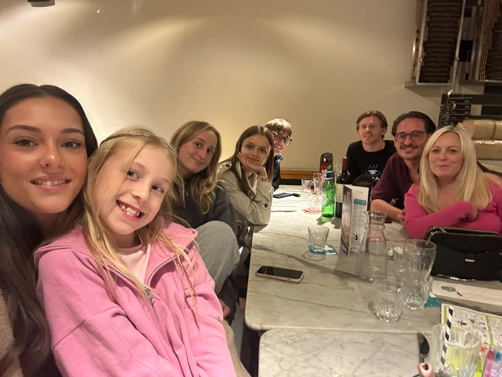
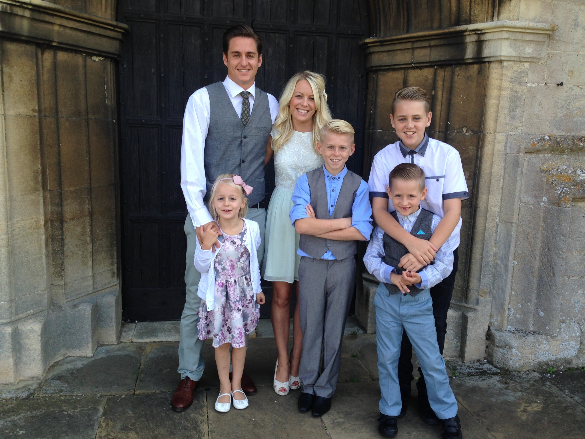

export { MDXLayout as default } from '../components/MDXLayout';
import { SEO } from "../components/SEO"

export const Head = (props) => (
  <SEO
    frontmatter={props?.pageContext?.frontmatter || {}}
    pathname={props?.location?.pathname || ''}
  />
);

I turned 46 this week. It's not a particularly significant birthday, one of those in-between ones that passes without much expectation beyond the usual cards, presents and perhaps an excuse to eat and drink a bit more than you should.

The day started with the familiar birthday display. Cards, presents and the effort Lauren had obviously put into making the occasion special. She'd also arranged a surprise meal for that evening. My response to this thoughtful gesture was something along the lines of "I could do without that!"

Not exactly the gratitude she deserved.

It had been a busy day, and by the time the evening came around I was tired and really couldn't be bothered. There wasn't anything particularly wrong, I'd just got myself into that familiar frame of mind where everything feels like another thing to do. Even the things you're supposed to enjoy. In fairness, I'm quite good at getting myself into that position. I have a habit of taking on more than I probably should, usually because something has interested me, and then occasionally becoming irritated when normal life wants a bit of my attention.

Anyway, we went, and I had a brilliant evening.

Looking at the photograph afterwards, the thing that struck me was the warmth. It had been cold that morning, noticeably so, and I'd felt it. The contrast with the evening probably made an impression, but I don't just mean the temperature. There's a warmth in the picture that I recognise immediately: people who genuinely enjoy one another's company, plenty of laughs, conversations going in different directions and the sort of atmosphere where nobody is particularly concerned about what time it is.

I went out feeling tired and a bit fed up, and came home feeling completely different. Nothing especially remarkable happened. We had a meal, talked, laughed and enjoyed being together, which perhaps explains why it worked so well. For a few hours I wasn't particularly bothered about the things I'd been thinking about all day.

What I also noticed, looking around that table, was how much our family has changed.

The children have grown up, or are getting there, and some now have partners who have gradually become part of the family themselves. I find that quite lovely, actually. People come into your life initially because they're important to somebody you love, but over time they become important to you as well. You get to know them, develop your own relationships, share experiences and before long it's difficult to imagine family occasions without them. It happens so gradually that you don't really notice it until you stop and look.

I found an old photograph from September 2014, taken at a christening. Lauren and I are standing with the children, all dressed up, looking considerably younger than we do now. The kids are still little, and although we had already been together for a few years by then, so much of what has happened since was still ahead of us.

Looking at the two pictures together is quite something. Not just because of how much everyone has changed physically, but because of everything that's happened between them. Twelve years of growing up, changing schools, becoming adults, relationships, work, celebrations, arguments, difficult periods and all the other things that make up a family history.

We've all grown up together, really. Lauren and I included.

That's something I don't think I've appreciated quite enough until recently. When you're bringing up children, you're also figuring out your own life as you go along. Nobody hands you a finished understanding of how to be a parent, a partner or a family. You make decisions, get things wrong, occasionally get things right and hopefully learn a bit along the way. The people in that old photograph weren't simply younger versions of the people we are today. We still had an awful lot to learn about ourselves and one another.

Which brings me back to Lauren.

We've been together for sixteen years now, and she's been an amazing step-mum throughout much of that time. I say that with the obvious qualification that I've never actually been a step-parent myself, so I can't claim to understand the experience in the same way she does.

It strikes me as an incredibly difficult role at times. You're joining relationships that already exist, with their own history and complications, and somehow finding your place within them. There are expectations and responsibilities, but the boundaries aren't always obvious. You care about children who aren't biologically yours, navigate all the normal challenges of family life and have to work out what being a parent means in circumstances that aren't always straightforward.

I know it hasn't always been easy, and I'm sure there are things Lauren has had to deal with that I've never fully understood or appreciated. Yet sixteen years later, when I look at our family, I see how much of it she's helped build.

I sometimes refer to her as the supporting act, usually because I'm the one disappearing into another idea or project while she's getting on with the practicalities of life. It's meant affectionately, but I do wonder whether it says something about the way we recognise people's contributions. The visible stuff tends to get the attention, while the effort that makes everything else possible is much easier to overlook.

It's something I've been thinking about in other parts of my life too. We're quite good at noticing outcomes and achievements, but not always so good at recognising the work, relationships and decisions that sit behind them. In family life, that can mean failing to appreciate how much somebody does because you've become accustomed to them doing it.

Lauren is very good at making things happen, including things that I probably wouldn't have bothered organising myself. She thinks about occasions, remembers what matters to people and makes an effort to bring everyone together. And on this particular occasion, she knew better than I did what I needed.

The irony is that I spend plenty of time thinking about how to live a meaningful life, what I want to do with the years ahead and the things I hope to achieve. I'm interested in ideas about time, purpose, relationships and what ultimately matters. Yet there I was, presented with an evening surrounded by people I love, and my immediate instinct was to avoid it because I had too much going on.

I'm not sure that says anything particularly profound about human nature, but it probably says something about me.

I've written before about the comfort of being busy. It's an interesting habit because being occupied can feel productive even when it isn't, and there's nearly always something else waiting to be done. I enjoy having projects and ambitions, and I don't particularly want to change that, but I do wonder whether I'm occasionally guilty of treating the people and experiences that matter most as interruptions to everything else.

That would be a rather poor way to spend the next forty-six years, assuming I'm fortunate enough to get them.

What I like about the birthday photograph is that it captures something I wouldn't necessarily have thought to value quite so much at the start of the day. A table full of people, some who've been in my life for decades and others who've joined along the way, all enjoying being together. The family in the 2014 picture has changed enormously, and it will undoubtedly keep changing. There will be new people, different occasions and all sorts of things we can't possibly anticipate. I hope there are plenty more photographs like these.

As for Lauren, she deserves considerably more recognition than she probably gets, particularly from me. Sixteen years is a lot of shared life, and I know how fortunate I am to have her alongside me. She's helped raise our family, supported me through all sorts of things and continues to put up with my endless ideas, projects and occasional grumpiness. The birthday meal was just one more example of her making an effort for everyone else, and I'm glad she ignored my initial reaction.

I could probably do with remembering that the next time she organises something. Because, as it turned out, I couldn't have needed that evening more.
