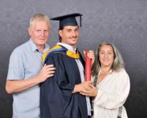

export { MDXLayout as default } from '../components/MDXLayout';
import { SEO } from "../components/SEO"

export const Head = (props) => (
  <SEO
    frontmatter={props?.pageContext?.frontmatter || {}}
    pathname={props?.location?.pathname || ''}
  />
);

The ceremony was formal and warm.

There were gowns, fixed smiles, instructions about where to stand and the slightly unfamiliar feeling of taking part in a ritual I had watched other people complete much earlier in their lives.

My mum and dad stood beside me for a photograph.

I was wearing the gown and mortarboard. They had a hand on each side of me, as though there was still some small possibility that I might escape before the evidence was captured.

I had finally graduated.

Their word, not mine.

## A first, eventually

I graduated from Anglia Ruskin University with a first-class BA Honours degree in Management and Leadership.

Even writing that still feels faintly improbable.

I had already built a career. I had spent around two decades working in technology and public service, progressing from operational and technical roles into management and leadership.

I had supported systems, written software, led teams, shaped services and become responsible for work that mattered to other people.

None of that had required a university degree.

At least, not formally.

My knowledge had accumulated through work: by trying things, solving problems, making mistakes, listening to people who knew more than me and occasionally discovering that the confident answer I had entered a room with was not the right one.

I had learnt largely in the order that life presented the problems.

Then, in September 2023, I found myself sitting in a very hot and sticky room at the Old Bridge Hotel in Huntingdon, beginning a degree apprenticeship.

The first session was on 7 September.

I was forty-three years old.

## The disappointment before it

The decision to study did not emerge from a carefully maintained academic ambition.

It followed disappointment.

In September 2022, I failed to secure a promotion I had expected to get.

At the time, I barely listened to the feedback. I constructed my own explanation instead. There must have been a hidden agenda. I had been prevented from progressing. The decision was unfair.

That account protected me from having to examine the possibility that there were things I still needed to develop.

Eventually, the anger gave way to a less comfortable question.

What was I going to do about it?

I could continue treating the setback as something done to me, or I could use it as evidence that the version of me who felt ready might not yet be the version other people could see.

The degree apprenticeship became part of that response.

In a report written during the course, I described the choice as reaching for the grit I associated with my parents and grandparents: deciding to act rather than accept myself as a victim of circumstances outside my control.

That sounds more heroic than it felt.

Mostly, it meant turning up.

## Learning after doing

Formal study initially felt like approaching familiar territory from the wrong direction.

I had experienced leadership before studying models of leadership.

I had dealt with organisational culture before reading attempts to explain it.

I had managed conflict, motivation, change and difficult relationships before being asked to cite anyone’s theory about them.

My instinct has always leaned towards doing.

In one of my reports, I described “action over intellectualising” as part of my core. I prefer direct experience to theoretical musing. Practice, to me, often provides a deeper understanding than analysis alone.

The course did not remove that instinct.

It made me examine it.

Experience can teach a great deal, but it can also reinforce habits that happen to have worked so far.

A person can repeat something for twenty years and call the repetition expertise.

Formal study introduced interruption.

It required me to slow down, name assumptions and place my own experience beside evidence that did not always support the story I told about myself.

One assignment examined emotional and cultural intelligence. I had thought of myself as naturally socially aware. The research and feedback suggested a more complicated picture: strengths in motivation, composure and relationships, alongside areas where greater empathy and self-awareness required deliberate effort.

That was uncomfortable.

It was also useful.

The degree did not simply confirm what I already knew.

At its best, it made what I already knew less secure.

## First-class doubt

I did not expect to get a first.

I hoped to do well. I worked hard. But there remained a quiet uncertainty about whether I properly belonged in academic work.

Practical credibility had always felt available to me.

I could point to things built, problems solved and responsibilities carried.

Academic credibility belonged to a different system: one with formal argument, evidence, word counts, marking criteria and the unnerving possibility that somebody might return several thousand words with a number attached.

There is nowhere to hide from a number.

Perhaps that is why receiving a first mattered.

Not because it proved that I was intelligent.

Not because it retrospectively validated my career.

It demonstrated that I could operate in a form of learning I had not previously used to define myself.

I could bring experience into an academic setting without assuming experience was enough.

I could learn the conventions without becoming trapped by them.

I could produce work that was both reflective and rigorous.

And I could finish.

## My parents never pushed us

My parents did not put academic pressure on us as children.

They gave us space.

They allowed each of us to decide what direction our lives might take, even when our choices were not necessarily the choices they would have designed.

There was no family campaign insisting that I attend university. No recurring speech about the opportunity I was wasting. No demand that I acquire the qualification they thought I ought to have.

But freedom does not mean parents stop wondering.

I think they had always felt that some academic potential had remained unrealised.

They had watched me build a good career and a family. They had seen me take responsibility and make progress without following the expected educational route.

They were proud of those things.

Graduation seemed to satisfy something slightly different.

When they said they were proud that I had “finally” graduated, the word contained more affection than criticism.

It was not:

> At last, you have become successful.

It was closer to:

> At last, you have completed this part of what we always believed you could do.

I may be projecting some of that onto them.

Parents do not always articulate these things as neatly as essays require.

But I could feel it.

They were happy.

And despite being old enough to have grown-up children of my own, their happiness mattered enormously.

## Somebody’s child again

There is something strange about standing between your parents in graduation robes when you are in your mid-forties.

For most of ordinary life, the generational roles have shifted.

You become the parent making plans, carrying worries and trying to appear confident enough that your children believe the adults know what is happening.

Your parents become older. The relationship changes. Responsibility begins, gradually and unevenly, to move in the other direction.

Then a graduation ceremony briefly resets the arrangement.

You are their child again.

They are there to see what you have done.

They straighten the gown, stand close for the photograph and display a pride that is not really about the certificate.

It is about the distance travelled.

Lauren was there too.

She had lived through the less ceremonial parts: the study fitted around work, the writing, the weekends partly occupied by assignments and the times when another deadline arrived in a life that already contained enough deadlines.

A ceremony compresses all of that into a stage, a handshake and a photograph.

It cannot show the support that made the moment possible.

## What the degree recognised

The certificate says Management and Leadership.

The course taught me a great deal about both.

But what I value most may be what it required me to learn about myself.

It exposed my preference for action.

It challenged the assumption that persistence alone can overcome every obstacle.

It gave me language for parts of my leadership I had previously treated as instinct.

It revealed gaps between how I understood myself and how others experienced me.

It made me more willing to test my own narrative.

Perhaps that is the difference between acquiring a qualification early in life and returning to education later.

When you are young, education can help construct an identity.

Later, it has to negotiate with one that already exists.

The useful learning occurs where the two disagree.

## Finally

Graduation is often presented as a beginning.

Mine felt more like a recognition of something that had already been happening for years.

I had been learning.

I had been leading.

I had been changing, occasionally reluctantly.

The degree did not begin that process, and graduation did not complete it.

But the day gave it a shape.

There I was, in the gown, holding the certificate, with my mum and dad beside me and Lauren nearby.

A first-class degree.

A formal photograph.

A warm room.

And the unexpected realisation that there is no age at which making your parents proud stops making you feel proud too.

I had finally graduated.

Perhaps they had been waiting longer than I realised.

Perhaps part of me had been waiting as well.
