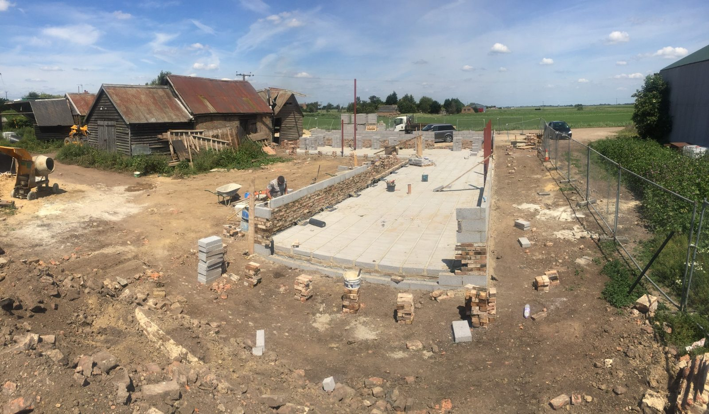
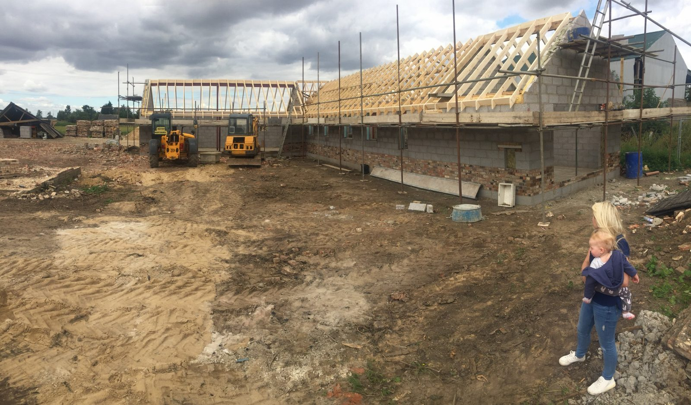
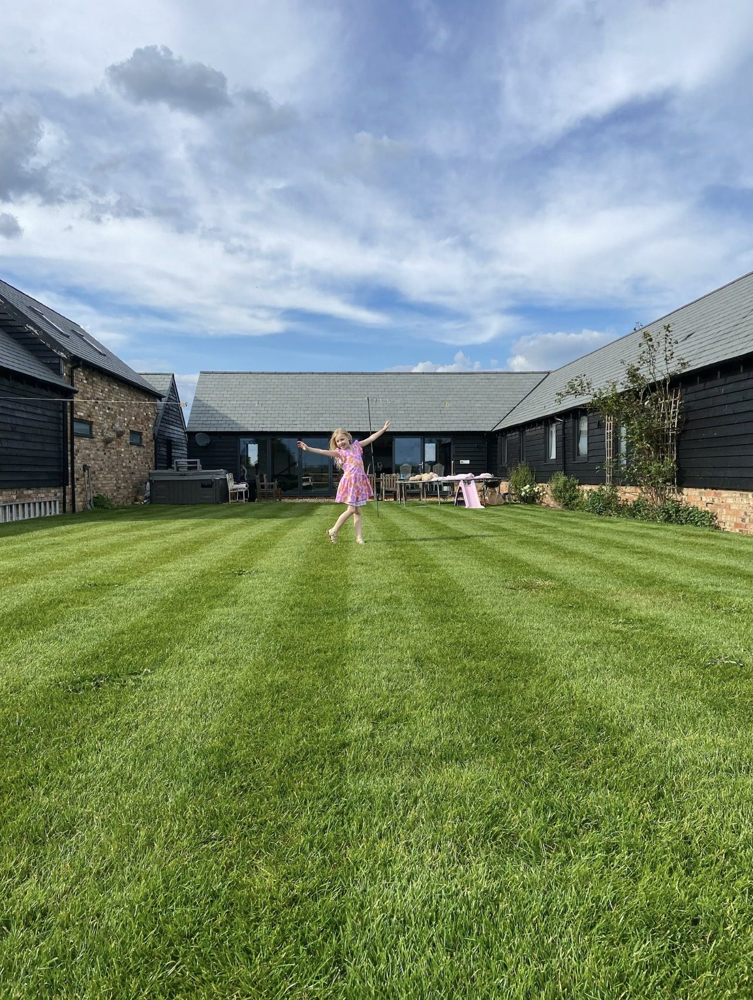

export { MDXLayout as default } from '../components/MDXLayout';
import { SEO } from "../components/SEO"

export const Head = (props) => (
  <SEO
    frontmatter={props?.pageContext?.frontmatter || {}}
    pathname={props?.location?.pathname || ''}
  />
);

“Will I resent this once I’ve completed it?”

A friend asked me that recently.

He was more than a year into building his home, far enough through that the initial excitement had been replaced by the relentless reality of making it exist. There were still decisions to make, problems to resolve and money leaving faster than anyone would comfortably describe as normal.

I recognised the question immediately.

This was not simply a house he had decided to build. It was the house he had talked about building when we were in our twenties. Long before either of us had the means, experience or perhaps the good sense to attempt it, he had described the kind of place he wanted to create.

Now he was creating it.

I told him that I was proud of him.

Whatever else the process was doing to him, he was realising something he had carried for decades. Most ambitions do not fail dramatically. They are gradually negotiated away by responsibility, timing, fear and the growing list of reasons that now is not the right moment.

He had not negotiated this one away.

I also told him the strain would remain part of the story.

He might not resent the finished house. Completion changes things. The building site becomes a home. The endless decisions reduce. The problems that dominated entire weeks eventually become anecdotes told from inside the rooms they helped create.

But worthwhile does not mean harmless.

I knew that because we had done it too.

## Building the dream

A self-build is normally described through the finished result.

Photographs show the completed kitchen, the view through the glazing and the carefully chosen materials. The story moves neatly from an empty plot or tired building to a home that appears inevitable in retrospect.

The process does not feel inevitable while you are inside it.

*Early in the build, when the finished house still required considerable imagination.*

It feels like thousands of decisions, many of which must be made before you have enough information. It feels like estimates becoming quotations and quotations becoming invoices that bear only a passing resemblance to the original estimate.

It is delays, compromises, conversations with trades, revised plans, temporary arrangements and the creeping realisation that every improvement in one place seems to create another problem somewhere else.

It is trying to maintain ordinary family life while a project of unusual scale consumes money, attention and emotional energy.

*The house taking shape while family life continued around the edges of the site.*

Eventually, the house becomes normal.

That may be the strangest part.

Something that once occupied almost every conversation becomes the place where you put the shopping away, search for missing school shoes and complain that somebody has left a light on.

The extraordinary effort becomes the setting for ordinary life.

That normality is partly the reward. We did not build a monument. We built somewhere to live.

But because we built it ourselves, the relationship is different.

We know why things are where they are. We remember the decisions behind them. Some parts carry pride; others contain compromises that nobody else would notice. There are details that recall a good decision made at exactly the right time and others that remind us we were too tired, too short of money or too far committed to reconsider.

A self-built home does not only contain your belongings.

It contains previous versions of you.

## The old sheet of paper

Around the same time as my friend asked his question, we were agreeing a new mortgage arrangement.

The ritual was reassuringly old-fashioned.

My mortgage adviser, who is also a friend, wrote the figures down on a piece of paper. He has done some version of this for me since I bought my first house in the early 2000s.

The method has remained remarkably stable while almost everything represented by the numbers has changed.

He has seen us through the good, the bad and the indifferent: different properties, changing circumstances, better decisions, difficult periods and the gradual construction of a life that would have been hard to imagine when we first sat down together.

There is something revealing about seeing the latest version reduced to handwriting.

A home of considerable physical and emotional complexity becomes a valuation, a balance, a rate, a term and a monthly payment.

The page gives the impression that everything can be located precisely.

This is what the house is worth.

This is what remains outstanding.

This is what must be paid.

From one perspective, the figures showed progress. We had a valuable home, a new arrangement and a plan to pay slightly more than required. The situation was understood rather than vague. One source of uncertainty had been replaced by a known obligation.

That matters.

But the page also made clear that progress and security are not the same thing.

## The house on both sides

A home is usually described as an asset.

That is true in the conventional financial sense. It has value. The mortgage balance can reduce. Equity can accumulate. Over a sufficiently long period, the property may become worth considerably more than it cost to create.

But our home also sits on the other side of the ledger.

It requires a substantial monthly payment. It needs heating, insuring, maintaining and occasionally repairing in ways that refuse to respect whatever else the household budget is trying to achieve.

A distinctive property does not become inexpensive to run simply because it is valuable.

Its worth may increase while its timber needs attention, equipment fails, the grounds demand work or another part of the original build reaches the age when it needs replacing.

Equity is real, but it is not the same as cash.

The house cannot pay an unexpected bill without being sold, refinanced or borrowed against. Its value does not remove our dependence on income arriving each month.

It can make us wealthier on paper while continuing to make demands in almost every other form.

That does not make the house a mistake.

It means that the language of assets and liabilities captures only part of the relationship.

The house appears on both sides.

## Is debt good?

Everybody has an opinion about debt.

Some describe it as a moral failure: evidence that somebody wanted something before they had earned the right to possess it.

Others describe it as leverage: a rational tool for acquiring assets, bringing forward investment or allowing future growth to fund present opportunity.

Mortgages are usually placed in the category of good debt. Credit cards are placed in the category of bad debt. The distinction is appealing because it turns a complicated set of trade-offs into two tidy boxes.

Reality is less cooperative.

The mortgage made our home possible. Without borrowing, the building would have remained an idea or required a very different life to come first.

That does not make the debt harmless.

It is still a claim on future income. It reduces the range of choices available each month. It relies on employment, health and circumstances remaining sufficiently stable. However attractive the asset may be, the obligation attached to it is not imaginary.

It would be dishonest to describe the mortgage only as something that happened to us.

We wanted the house on the other side of it.

We wanted the space, the setting, the design and the satisfaction of creating something that felt like ours. There was ambition in the decision, and probably some ego. We trusted that our future selves would be able to carry the commitments our present selves were making.

So perhaps the useful questions about debt are not whether it is inherently good or bad.

What did it make possible?

What does it continue to cost?

Can it be sustained without everything going exactly to plan?

Does it create future choices or steadily remove them?

And, perhaps most importantly, is the life on the other side of the payment still worth what is being asked for it?

## The next reassuring number

I have a tendency to believe that the next financial improvement might finally make everything feel settled.

A better mortgage arrangement.

A lower card balance.

A larger emergency fund.

A higher salary.

A stronger credit score.

A little more paid from the mortgage each month.

None of these aims is foolish. Each would improve the household position in a measurable way.

But there is always another number behind the number.

A particular savings balance feels reassuring until the roof, car or heating system produces a larger one. A pay rise creates breathing room until costs expand or a new responsibility arrives. A reducing mortgage offers satisfaction while the remaining balance is still large enough to require years of work.

Financial organisation is necessary. I would rather understand the commitments than avoid looking at them.

But there is a point at which optimisation becomes an attempt to make uncertainty disappear.

Life refuses.

Homes need work. Jobs change. Children grow. Relationships and responsibilities develop in ways no mortgage illustration can capture.

Sometimes the discomfort is not a psychological failure to appreciate progress.

Sometimes it is an accurate understanding that a household remains more exposed than its apparent success suggests.

## What the accounts leave out

The sheet of paper could tell us the estimated value of the home and what remained to be repaid.

It could not record what building it took from us.

Nor could it properly record what it gave.

There is no column for the pressure placed on a relationship by months of decisions and uncertainty.

There is no valuation for evenings spent discussing problems neither person felt equipped to solve.

There is no neat way to account for the pride of standing inside something that once existed only as a plan.

The finished home contains all of it.

That is why my friend’s question matters.

He was asking whether the cost of building might become inseparable from the experience of living there. Whether every room would remind him of the pressure required to complete it.

I do not think it will, at least not in the way he fears.

The strain will fade from the foreground. Ordinary life will occupy the building. People will visit without knowing which decision nearly broke him or which part took three attempts to get right.

He will begin to see the home rather than the project.

But I would not tell him that the cost will vanish.

Nor should it have to.

## More than one thing can be true

*The project eventually became the place where ordinary family life happens.*

I do not resent our house.

I am proud of it.

It gave our family something that could not have been bought in quite the same way. It proved that an ambitious idea could survive years of practical difficulty and become real.

It has also demanded more than the final accounts show.

It is an asset without making us independent. It is a source of security and a reason we require security. It represents progress while tying a considerable part of our future to maintaining what we have built.

These are not contradictions that need to be resolved.

More than one thing can be true.

My friend can be exhausted by the process and still be achieving something extraordinary. I can warn him about the emotional cost while feeling genuinely proud that the dream he described in our twenties is finally rising from the ground.

He may reach the end and wish parts of the journey had been different.

He may even resent what the project asked of him at times.

That is not the same as resenting the home.

Perhaps the best we can hope for is not that the difficult parts disappear, but that the life created afterwards becomes large enough to hold them.

The building will eventually stop being the dream.

It will become the place where the rest of his life happens.
